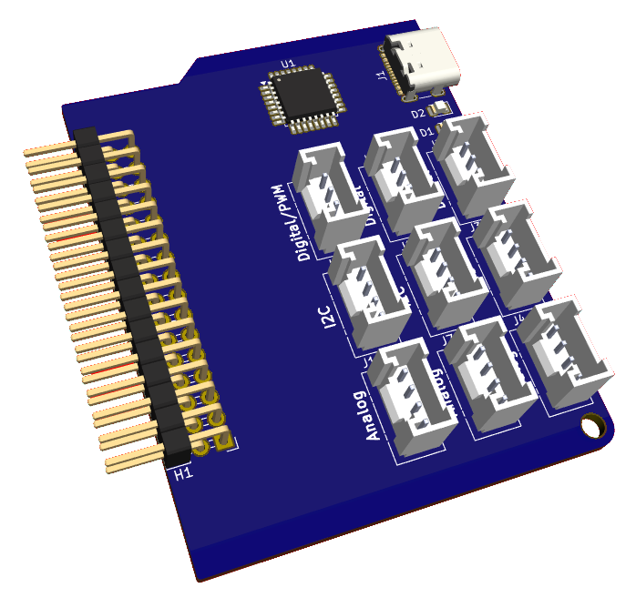

>[!important]
>**This Hardware Cartridge is still in a very early stage of development**. Its exact content and features are still being defined.

The **EDU Hardware Cartridge** is created especially for supporting educational exploration of electronics in IoT. lorem ipsum dolores si amet ...

 

## License & Collaboration
**Copyright© 2024 Sanne 'SpuQ' Santens**. This project is released under the **CERN OHL-W** license.

### Collaboration

If you'd like to contribute to this project, please follow these guidelines:
1. Fork the repository and create your branch from `main`.
2. Make your changes and ensure they adhere to the project's design style and conventions.
3. Test your changes thoroughly.
4. Ensure your commits are descriptive and well-documented.
5. Open a pull request, describing the changes you've made and the problem or feature they address.